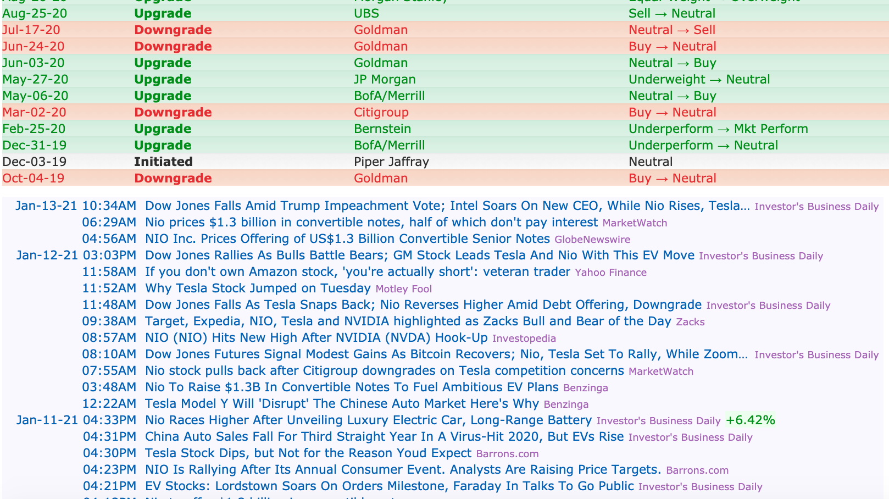
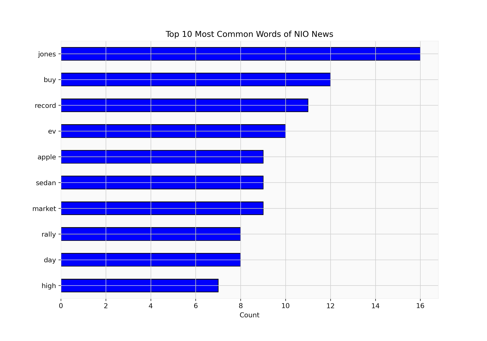
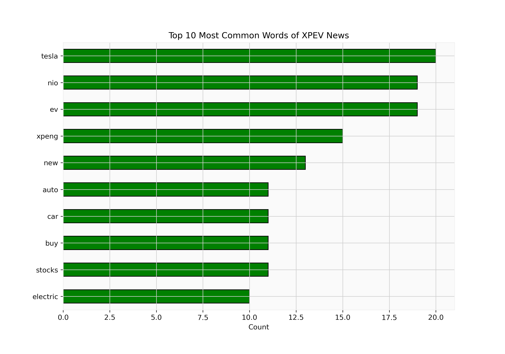
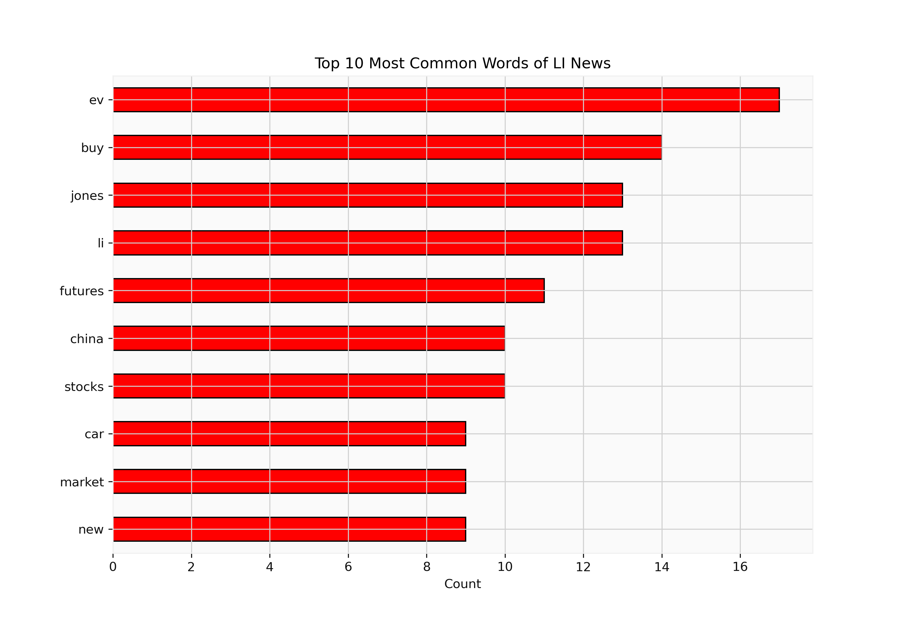
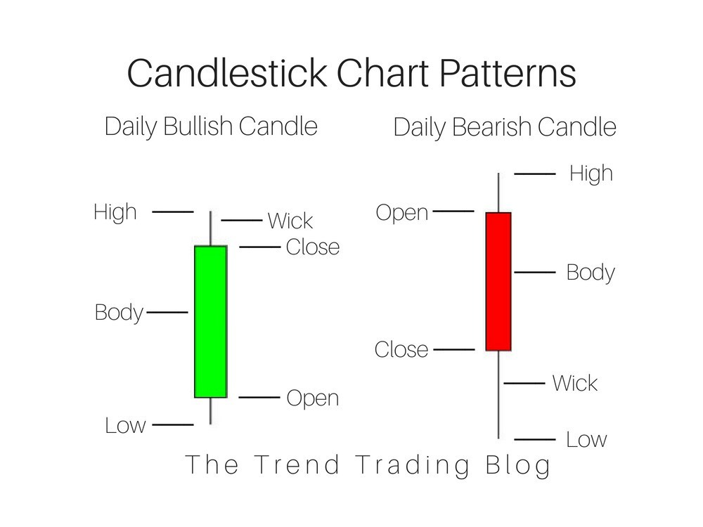
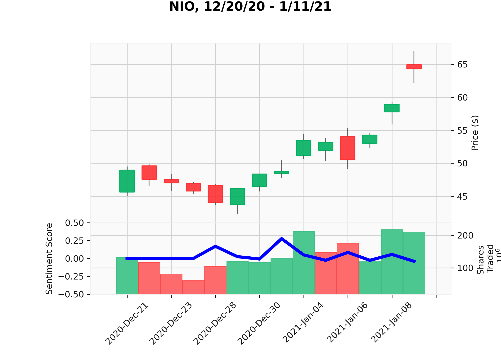
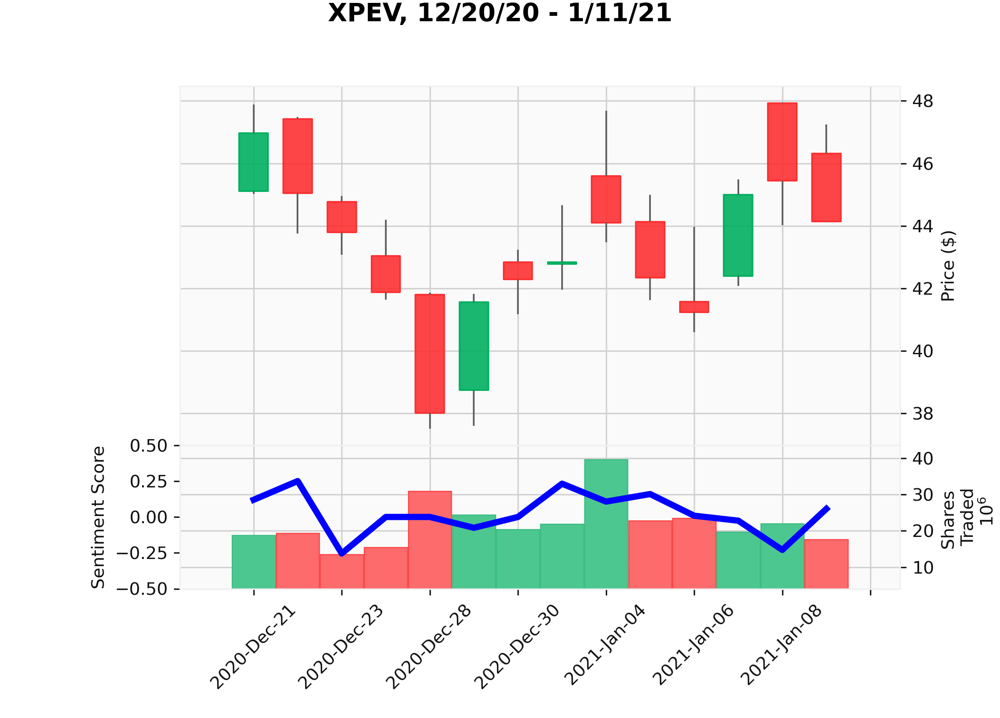
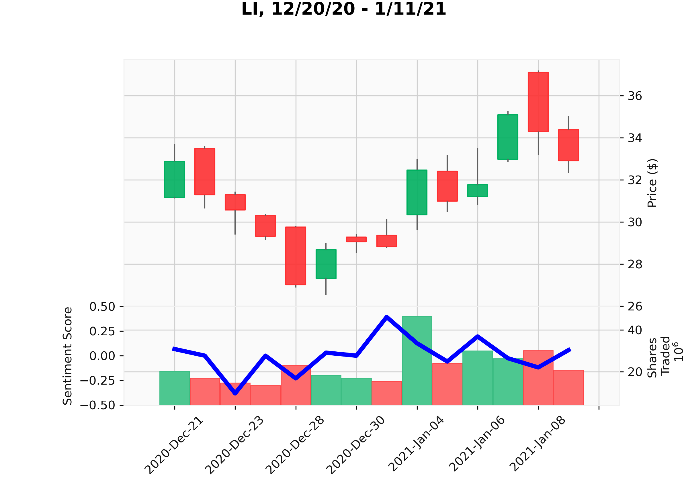
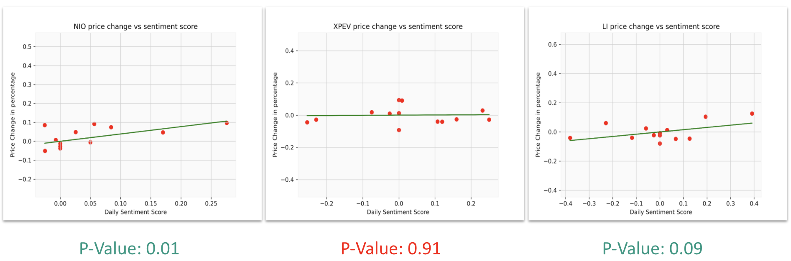
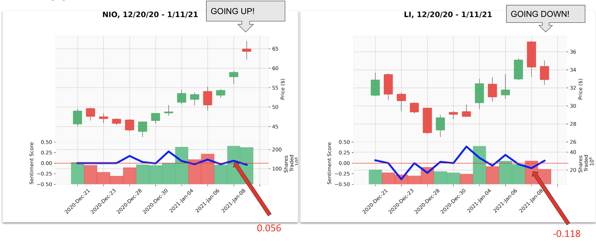

# Sentiment_Analysis_of_Stock_News(Draft)
Sentiment analysis of financial news headlines as an indicator of investment suggestions.

# Background Information

## What is Sentiment Analysis?
Sentiment analysis, also known as opinion mining, refers to the use of natural language processing, text analysis and computational linguistics to identify and extract subjective information in source materials. (Wikipedia)

## Why do we need Sentiment Analysys?
Why can’t humans just read the texts? Why do we need a machine to do it for us?
Reasons for using sentiment analysis:
* Machines can read much faster (maybe a million times faster) than humans
* Machines can read in many languages
* Machines can derive meaning from text in a standardised manner (humans are subjective)
* Machines can store insights from texts in a convenient way for further processing## How is Sentiment Analysis used for stock trading?

## How is Sentiment Analysis used for stock trading?

The most common use of Sentiment Analysis in the financial sector will be the analysis of financial news, in particular to predicting the behaviour and possible trend of stock markets. Nowadays, sentiment analytics has been receiving a lot of attention in financial industry.

## Why Electric Vehicle(EV) stocks?

Electric vehicle stocks are hot, as growing numbers of investors come to recognize the major shift going on in the industry, both in the U.S. and abroad. Electric vehicles are more efficient, better for the environment, deliver better performance, and cost less to maintain. There is no doubt that Electric Vehicle will be the future of the auto industry.

# Web Scrapping
Access to the most up-to-date information is vital to any investing strategy. I used BeautifulSoup to parse the news headline and timestamp for stock NIO, XPEV and LI from Finviz, a website offers interactive graphs, fundamental ratios and financial news.etc. 

The news headline and timestamp was parsed from the Website and stored in pandas dataframe. Then I cleaned the news headline by removing stopwords, punctuations.etc.

## Word Count
After cleaned the news headline, I conducted a little bit EDA and generate this most common word counts for all three target stocks, nio, xpeng and li. As you can see, their ticker names are keep showing up in the competitor’s most common words, which indicates that there are a lot of times they were been mentioned together in the same news as well as tesla.

# Sentiment Analysis

## What is Vader?
VADER stands for “Valence Aware Dictionary and sEntiment Reasoner”. It is a sentiment analyser that is trained using social media and news data using a lexicon-based approach. This means that it looks at words, punctuation, phases, emojis etc and rates them as positive or negative. It is available in the NLTK package and can be applied directly to unlabeled text data.
VADER sentiment analysis relies on a dictionary that maps lexical features to emotion intensities known as sentiment scores, on a scale of -1 to 1. The compound sentiment score of a text can be obtained by summing up the intensity of each word in the text. 

## Import Stock Data
After getting the sentiment score, I would like to see if there is any correlation between the sentiment score and the actual stock price movement. So I import the stock data from yahoo finance and generated a daily candlestick chart with trading volume at the bottom. 
For those who are not familiar with candlestick chart, the following image will be a good explaination of how it works. Basically a green candle means bullish price movement and a red candle means bearish price movement.

## Sentiment Score vs Stock Price Change
I plot the sentiment score, which is the blue line on top of the financial data of all three stocks, and trying to see if the sentiment score of one particular stock have any correlation with the next day’s price movement.

# Conclusion

After running the correlation model, I successfully proved that there are linear correlations between the sentiment score and next day’s price change for stock NIO and Li, but the p-value for Xpeng is too large so we failed to draw conclusion on Xpeng.

# Application
So how can we use what I got from this project to make investment decision? 

Let’s assume that today is Jan 8, 2021. As you can see the sentiment score for Nio is at 0.056 which indicate there’s a positive polarity and -0.118 for Li. If we are going to invest between this two stocks tomorrow, which one should you buy? 
I will say Nio, since nio has a positive sentiment score but li has a negative sentiment score. Ok let’s see if we made the right decision or not? Apprentaly on Jan 9 the stock price of Nio went up but li’s price is went down as we predicted. So the model we built actually works!
